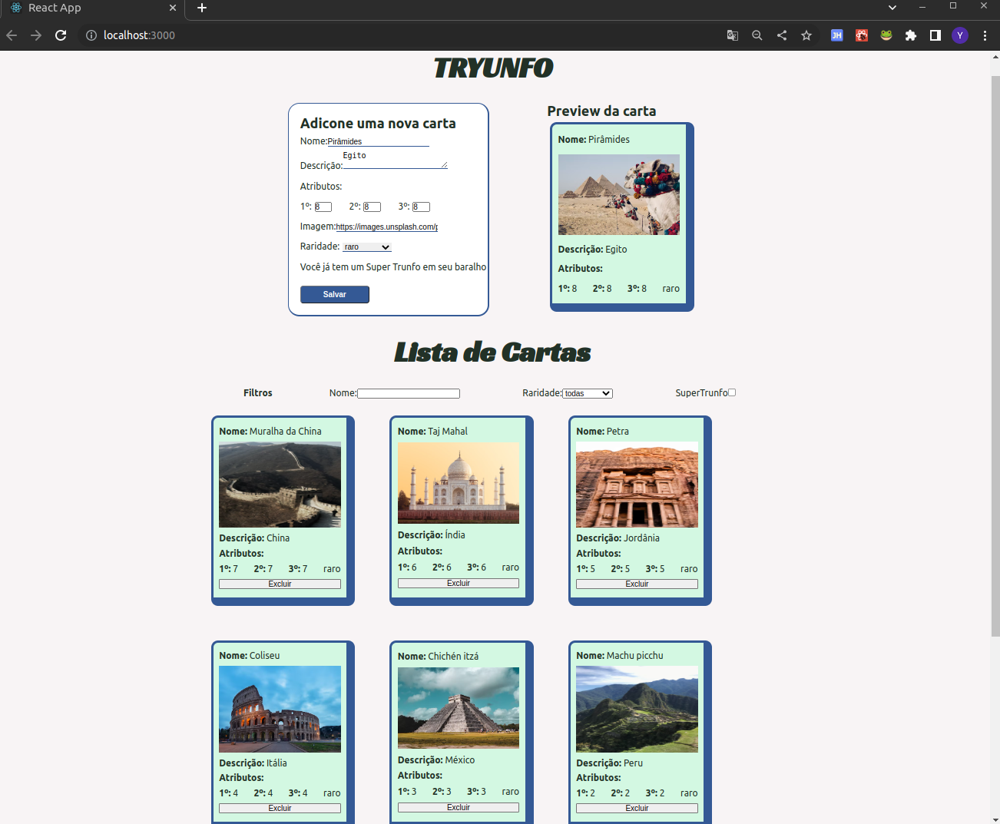

# Projeto Super Tryunfo

Projeto realizado durante o curso de Desenvolvimento Web na Trybe em Março, 2023.

# Conhecimentos técnicos utilizados: 

* HTML, 
* CSS, 
* JavaScript,
* React (manipulação dos estados de um componente, capturar eventos, transmitir informações entre componentes, criar formulários com a sintaxe JSX)

# Objetivo:

Uma apliação para criar cartas de um baralho Super Trunfo.

# Requisitos:

* Incluir um formulário
* Incluir um ipreview da carta
* Validação de formulário
* Listar as cartas criadas
* Colocar opção de remover carta do baralho
* Incluir filtros para pesquisa na lista de cartas

# Resultado:

* Simulando um jogo de cartas com as 7 Maravilhas do Mundo

